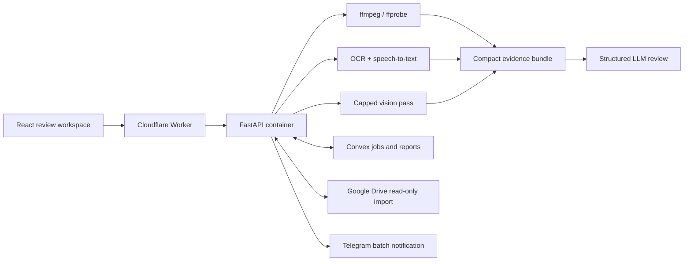

# Vibe Check

[](https://github.com/AliKhairreddin/vibe-check/actions/workflows/deploy.yml)

Vibe Check is a cloud-native ad-compliance review system for video, image, and copy-only creatives. It converts raw media into compact, traceable evidence—metadata, sampled frames, OCR, transcript segments, and visual observations—then produces a structured decision-support report against saved publisher guidance and optional campaign-specific policies.

**Live application:** [vibe-check.thatcanadian.dev](https://vibe-check.thatcanadian.dev)

> **Status:** Deployed internal MVP. Reports support human review; they are not official publisher approval and should not be treated as legal advice.

## Why This Project Exists

Creative review is slow when a reviewer must separately inspect video frames, on-screen text, spoken claims, captions, and policy documents. Vibe Check turns that fragmented process into a repeatable pipeline while preserving the evidence behind every result.

The system is intentionally hybrid:

- deterministic media tooling extracts observable facts;
- bounded AI stages interpret only compact evidence;
- durable job records make batch progress and final reports recoverable;
- uncertain or ambiguous source matches fail safely instead of guessing.

## What It Does

- Accepts MP4, JPG, PNG, WebP, or one copy-only review per non-empty input line.
- Extracts media metadata with `ffprobe`, audio and frames with `ffmpeg`, and OCR-ready imagery with Pillow/OpenCV.
- Runs Tesseract OCR, timestamped speech-to-text, and a capped sampled-frame vision pass.
- Produces strict JSON reports with separate creative and ad-copy results.
- Uses a four-level verdict model: green, yellow, orange, and red.
- Handles files up to 200 MB through retryable 8 MB chunks.
- Admits uploads and processes review jobs through bounded parallel pools (four by default, configurable up to eight).
- Persists batches, job state, report JSON, and source metadata in Convex.
- Supports folder-scoped Google Drive browsing/import with exact file IDs and safe duplicate handling.
- Sends one Telegram summary after every item in a batch reaches a terminal state.
- Provides cursor-paginated review history and direct report/source links.

## Architecture



### Runtime Boundaries

- **Cloudflare Worker:** serves the built frontend and proxies `/api/*` requests.
- **Cloudflare Container:** runs FastAPI plus native media/OCR dependencies.
- **Convex:** stores durable workflow state and report data, not uploaded media.
- **Temporary container storage:** holds uploaded creatives and derived artifacts only while a job is running.

R2 is intentionally not required. Uploaded creatives, extracted audio, frames, OCR intermediates, and visual-observation artifacts are removed after processing.

## Engineering Highlights

### Bounded Concurrency

Heavy jobs may run ffmpeg, OCR, vision, transcription, and final analysis. The queue therefore uses a configurable semaphore rather than launching an unbounded task for every upload. Browser admission and backend processing are both parallelized without overwhelming a single container.

### Evidence and Cost Control

The final analysis receives deduplicated OCR, timestamped transcript chunks, a capped number of resized frames, and compact visual observations. This reduces repeated tokens and prevents full-resolution media from being forwarded unnecessarily.

### Source Integrity

Drive imports retain the selected file ID. Filename-based lookups are constrained to the configured folder and use file size to disambiguate new uploads; missing or ambiguous matches never produce a guessed link.

### Failure-Aware Batch State

Batches are registered before item uploads begin. Upload failures become terminal records, so one broken item cannot leave the entire batch or Telegram notification waiting forever.

### Regression Coverage

The repository currently includes 55 backend tests covering pipeline behavior, chunked upload rules, parallel processing, Drive boundaries, durable state, source links, and failure handling.

## Technology

| Layer | Technologies |
| --- | --- |
| Frontend | React, TypeScript, Vite, TanStack Router/Query/Table, Tailwind CSS |
| API | FastAPI, Pydantic, Python |
| Media | ffmpeg, ffprobe, OpenCV, Pillow, Tesseract |
| AI | OpenRouter chat, vision, and speech-to-text models |
| Runtime | Cloudflare Workers, Static Assets, Containers |
| State | Convex |
| Delivery | GitHub Actions, Wrangler, Docker |

## Repository Layout

```text
backend/app/                 FastAPI entry point and review pipeline
backend/tests/               Pipeline and API regression tests
frontend/src/                Review workspace and report UI
worker/                      Cloudflare Worker router/container binding
convex/                      Durable batch and review state
scripts/                     Verification helpers
Dockerfile                   Container image with native media tooling
wrangler.jsonc               Worker, assets, container, and route config
```

## Local Development

### Prerequisites

- Python 3.12
- Node.js and pnpm
- ffmpeg/ffprobe
- Tesseract
- Docker, when testing the production container shape

```bash
cp .env.example .env
python3.12 -m venv .venv
. .venv/bin/activate
pip install -r backend/requirements.txt
pnpm install
uvicorn backend.app.main:app --reload --port 8000
pnpm --dir frontend dev
```

The frontend creates one review job per selected creative. With no creative selected, every non-empty ad-copy line becomes a separate job.

## Configuration

Use [`.env.example`](.env.example) as the source of truth. Important groups include:

- `OPENROUTER_*` for final analysis, vision, and speech-to-text models;
- `CONVEX_URL`, `CONVEX_DEPLOYMENT`, and `CONVEX_HTTP_SECRET` for durable state;
- `GOOGLE_DRIVE_SERVICE_ACCOUNT_JSON` and `GOOGLE_DRIVE_FOLDER_ID` for folder-scoped import;
- `TELEGRAM_*` for batch completion notifications;
- `MAX_UPLOAD_MB` and `JOB_WORKER_CONCURRENCY` for resource limits.

Secrets belong in Convex or Cloudflare runtime configuration, never in the browser bundle or repository.

## API Overview

| Endpoint | Purpose |
| --- | --- |
| `POST /api/reviews` | Create a creative or copy-only review |
| `POST /api/batches` | Register a durable multi-item batch |
| `GET /api/batches/{batch_id}` | Read aggregate and item progress |
| `GET /api/reviews/history` | Browse cursor-paginated history |
| `GET /api/reviews/{job_id}` | Read job state |
| `GET /api/reviews/{job_id}/report` | Read structured report JSON |
| `GET /api/reviews/{job_id}/source` | Resolve safe creative/copy source links |

Default publisher guidance lives in `backend/app/review_pipeline/guidelines/` and is combined with optional policy text submitted for a review.

## Verification

```bash
pnpm run verify
```

The verification gate regenerates Worker types, type-checks the Worker, runs backend tests, and builds the production frontend.

## Deployment

```bash
pnpm run convex:deploy
```

Pushes to `main` trigger `.github/workflows/deploy.yml`, which verifies the repository, deploys Convex, builds the Docker-backed container image, and deploys Cloudflare. The container release intentionally runs in GitHub Actions because the runner has Docker available.

## Known Limitations

- Frame sampling can miss very short visual disclosures.
- OCR may miss small, stylized, moving, or obstructed text.
- Speech timestamps are approximate chunk ranges rather than word-level alignment.
- Long audio can exceed upstream transcription timeouts; short advertising creatives are the intended path.
- Vision review sees capped, resized samples rather than every frame.
- Review quality still depends on the supplied policy context and selected models.
