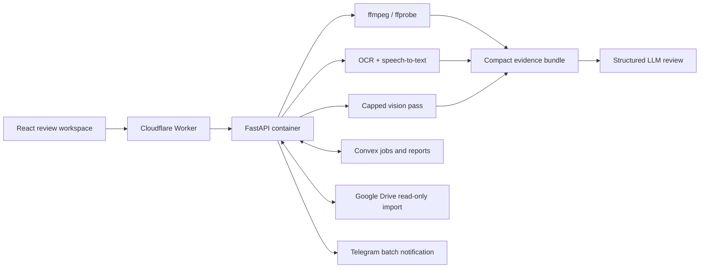

# Vibe Check

[](https://github.com/AliKhairreddin/vibe-check/actions/workflows/deploy.yml)

Vibe Check is a cloud-native ad-compliance review system for video, image, and copy-only creatives. It converts raw media into compact, traceable evidence—metadata, sampled frames, OCR, transcript segments, and visual observations—then produces a structured decision-support report against saved publisher guidance and optional campaign-specific policies.

**Live application:** [vibe-check.thatcanadian.dev](https://vibe-check.thatcanadian.dev)

> **Status:** Deployed internal MVP. Reports support human review; they are not official publisher approval and should not be treated as legal advice.

## Why This Project Exists

Creative review is slow when a reviewer must separately inspect video frames, on-screen text, spoken claims, captions, and policy documents. Vibe Check turns that fragmented process into a repeatable pipeline while preserving the evidence behind every result.

The system is intentionally hybrid:

- deterministic media tooling extracts observable facts;
- bounded AI stages interpret only compact evidence;
- durable job records make batch progress and final reports recoverable;
- uncertain or ambiguous source matches fail safely instead of guessing.

## What It Does

- Accepts MP4, JPG, PNG, WebP, or one copy-only review per non-empty input line.
- Extracts media metadata with `ffprobe`, audio and frames with `ffmpeg`, and OCR-ready imagery with Pillow/OpenCV.
- Runs Tesseract OCR, timestamped speech-to-text, and a capped sampled-frame vision pass.
- Produces strict JSON reports with separate creative and ad-copy results.
- Evaluates one evidence bundle against every active offer with saved guidelines; inactive or unconfigured offers remain visible as N/A.
- Applies offer-scoped current internal rules above source guidelines on exact conflicts, while recording every permitted exception that changes a run decision.
- Uses a three-level action model: green for ready-to-run results, yellow for routine fixes or review, and red only when a deterministic server guard verifies an approved severe consequence in the controlling effective policy.
- Handles files up to 400 MB through retryable 8 MB chunks.
- Admits uploads and processes review jobs through bounded parallel pools (four by default, configurable up to eight).
- Persists batches, job state, report JSON, and source metadata in Convex.
- Supports folder-first Google Drive browsing, whole-folder selection, drill-down file selection, and exact-ID deduplication.
- Sends one multi-offer Telegram summary after every item in a batch reaches a terminal state.
- Generates combined PDFs with offer labels and partner-specific PDFs without the partner name inside the pages; partner names remain in download filenames.
- Provides an offer-filtered dashboard, cursor-paginated history, recoverable history removal, and direct report/source links.
- Saves disabled-by-default Drive review automations with timezone, weekday, time, subfolder, and filename-glob controls.
- Accepts automatic live-ad observations from the bundled Chrome extension, deduplicates media by normalized creative name, and reviews each unique primary text separately as copy-only evidence.
- Shows accounts observed by media buyers today on a dedicated Live Scans page and sends completed live creative/copy findings to Telegram.
- Exposes a versioned, account-isolated Partner API with scoped keys, resumable uploads, signed completion webhooks, durable expanded evidence, retention controls, and optional unlimited internal usage.

## Architecture


```mermaid
flowchart LR
    U["React review workspace"] --> W["Cloudflare Worker"]
    W --> C["FastAPI container"]
    C --> M["ffmpeg / ffprobe"]
    C --> O["OCR + speech-to-text"]
    C --> V["Capped vision pass"]
    M --> E["Compact evidence bundle"]
    O --> E
    V --> E
    E --> L["Structured LLM review"]
    C <--> D["Convex jobs and reports"]
    C <--> G["Google Drive read-only import"]
    C --> T["Telegram batch notification"]
```

### Runtime Boundaries

- **Cloudflare Worker:** serves the built frontend and proxies `/api/*` requests.
- **Cloudflare Container:** runs FastAPI plus native media/OCR dependencies.
- **Convex:** stores durable workflow state and report data, not uploaded media.
- **Temporary container storage:** holds uploaded creatives and derived artifacts only while a job is running.

R2 is intentionally not required. Uploaded creatives, extracted audio, frames, OCR intermediates, and visual-observation artifacts are removed after processing.

## Engineering Highlights

### Bounded Concurrency

Heavy jobs may run ffmpeg, OCR, vision, transcription, and final analysis. The queue therefore uses a configurable semaphore rather than launching an unbounded task for every upload. Browser admission and backend processing are both parallelized without overwhelming a single container. Video transcription starts as soon as audio extraction completes and overlaps frame extraction, OCR, and vision analysis. Short audio is transcribed in one timestamped request; longer audio retains bounded chunking with concurrent requests.

The Worker consistently shards new review submissions across named container instances with `REVIEW_BACKEND_SHARDS`. Upload requests carry a per-review shard key so every chunk and completion request reaches the same container. Production uses ten `standard-3` shards with five review workers each, providing a configured ceiling of 50 concurrently processing creatives; the browser admits up to ten uploads at once so large files do not create 50 simultaneous client uploads. Convex remains the durable source of job, report, batch, artifact, and processing-timing state across shards.

### Evidence and Cost Control

The final analysis receives deduplicated OCR, timestamped transcript chunks, a capped number of resized frames, and compact visual observations. This reduces repeated tokens and prevents full-resolution media from being forwarded unnecessarily.

### Source Integrity

Drive imports retain the selected file ID. Filename-based lookups are constrained to the configured folder and use file size to disambiguate new uploads; missing or ambiguous matches never produce a guessed link.

### Failure-Aware Batch State

Batches are registered before item uploads begin. Upload failures become terminal records, so one broken item cannot leave the entire batch or Telegram notification waiting forever.

### Regression Coverage

The repository currently includes 176 backend tests covering pipeline behavior, consequence-based red enforcement, multi-offer eligibility and N/A snapshots, multi-offer dashboard statistics, effective-policy precedence, internal rules and exceptions, partner-specific PDFs, scheduled automation claims and retries, live-scan ingestion, Telegram output, folder selection, deletion/statistics, admin authorization, Partner API authentication, ownership isolation, webhook signing, browser API routing, size limits, chunked uploads, parallel processing, Drive boundaries, durable state, source links, and failure handling.

## Technology

| Layer | Technologies |
| --- | --- |
| Frontend | React, TypeScript, Vite, TanStack Router/Query/Table, Tailwind CSS |
| API | FastAPI, Pydantic, Python |
| Media | ffmpeg, ffprobe, OpenCV, Pillow, Tesseract |
| AI | OpenRouter chat, vision, and speech-to-text models |
| Runtime | Cloudflare Workers, Static Assets, Containers |
| State | Convex |
| Delivery | GitHub Actions, Wrangler, Docker |

## Repository Layout

```text
backend/app/                 FastAPI entry point and review pipeline
backend/tests/               Pipeline and API regression tests
frontend/src/                Review workspace and report UI
extension/                   Unpacked Chrome extension for automatic Meta Ads Manager observation
worker/                      Cloudflare Worker router/container binding
convex/                      Durable batch and review state
scripts/                     Verification helpers
Dockerfile                   Container image with native media tooling
wrangler.jsonc               Worker, assets, container, and route config
```

## Local Development

### Prerequisites

- Python 3.12
- Node.js and pnpm
- ffmpeg/ffprobe
- Tesseract
- Docker, when testing the production container shape

```bash
cp .env.example .env
python3.12 -m venv .venv
. .venv/bin/activate
pip install -r backend/requirements.txt
pnpm install
uvicorn backend.app.main:app --reload --port 8000
pnpm --dir frontend dev
```

The frontend creates one review job per selected creative. With no creative selected, every non-empty ad-copy line becomes a separate job. Offer selection is server-owned: every enabled profile with non-empty official guidelines is evaluated, and callers cannot force disabled offers to run or omit eligible offers.

## Configuration

Use [`.env.example`](.env.example) as the source of truth. Important groups include:

- `OPENROUTER_*` for final analysis, vision, speech-to-text, throughput-first provider routing, and per-request ZDR/data-collection enforcement on chat and vision calls;
- `CONVEX_URL`, `CONVEX_DEPLOYMENT`, and `CONVEX_HTTP_SECRET` for durable state;
- `GOOGLE_DRIVE_SERVICE_ACCOUNT_JSON` and `GOOGLE_DRIVE_FOLDER_ID` for folder-scoped import;
- `TELEGRAM_*` for batch completion notifications;
- `ADMIN_PASSWORD` for protected guideline, internal-rule, revision, and history-removal actions;
- `CLIENT_ADMIN_PASSWORD`, `KISSTERRA_CLIENT_PASSWORD`, `ACP_CLIENT_PASSWORD`,
  `LEAD_ECONOMY_CLIENT_PASSWORD`, and `SMART_FINANCIAL_CLIENT_PASSWORD` for the
  role-scoped client review portal. Usernames default to `admin`, `kissterra`,
  `acp`, `lead-economy`, and `smart-financial` and can be overridden with the
  matching `*_CLIENT_USERNAME` variables;
- `MAX_UPLOAD_MB`, `JOB_WORKER_CONCURRENCY`, and `REVIEW_BACKEND_SHARDS` for resource limits and container distribution.

Each review writes its latest processing-attempt timing to one `reviewProcessingMetrics` document after it finishes. The document separates queue wait from per-stage time and supports overlapping stages, so p50/p90 measurements can distinguish Cloudflare CPU work, OpenRouter calls, Convex persistence, and report-artifact generation without adding a Convex mutation at every progress update. Keep OpenRouter's account-wide ZDR setting enabled as well: its transcription endpoint does not currently accept the same per-request provider-routing controls as chat and vision.

Secrets belong in Convex or Cloudflare runtime configuration, never in the browser bundle or repository.
The public offer catalog contains names and version counts only. Full official guidelines and current internal rules require an admin password, which the Settings page keeps in browser session storage after it verifies the password with the backend. Configure production with `pnpm exec wrangler secret put ADMIN_PASSWORD` before using Settings or removing history.

The client portal is available at `/client`. It uses username/password access,
stores the credentials in browser session storage after server verification,
and persists client approve/disapprove decisions separately from the automated
verdict. The client admin account can switch between Kissterra, ACP, Lead
Economy, and Smart Financial. Each client account is enforced server-side to its
own offer. The former `/kissterra` routes redirect into this shared portal.

## API Overview

The server-to-server Partner API is rooted at `https://vibe-check.ali-kheireddin1.workers.dev/api/v1`. The dedicated Worker hostname avoids browser-only edge challenges on the application domain. Administrators manage partner accounts, unlimited or bounded usage, offer entitlements, scoped keys, expiry/revocation, evidence retention, and signed webhooks in **Settings → API access**. See [the Partner API guide](docs/partner-api.md) or the deployed V1-only Swagger page at `/api/v1/docs`.

| Endpoint | Purpose |
| --- | --- |
| `POST /api/v1/reviews` | Authenticated partner creative or copy-only submission |
| `POST /api/v1/uploads` | Start an authenticated resumable creative upload |
| `GET /api/v1/reviews/{job_id}/result` | Read an owned structured report and artifact links |
| `GET /api/v1/reviews/{job_id}/evidence` | Read owned transcript, OCR, visual observations, and protected frames |
| `GET /api/v1/reviews` | Browse cursor-paginated partner-owned history |
| `POST /api/reviews` | Create a creative or copy-only review |
| `POST /api/batches` | Register a durable multi-item batch |
| `GET /api/batches/{batch_id}` | Read aggregate and item progress |
| `GET /api/reviews/history` | Browse cursor-paginated history |
| `GET /api/reviews/stats` | Read offer-filtered dashboard totals |
| `DELETE /api/reviews/{job_id}` | Admin-only soft removal of a terminal review from history and stats |
| `GET /api/reviews/{job_id}` | Read job state |
| `GET /api/reviews/{job_id}/report` | Read structured report JSON |
| `GET /api/reviews/{job_id}/source` | Resolve safe creative/copy source links |
| `GET /api/reviews/{job_id}/evidence` | List durable timestamped evidence frames |
| `GET /api/client/check` | Verify client credentials and return the allowed client scopes |
| `GET /api/client/{client_id}/reviews` | Read the authenticated account's offer-scoped review queue |
| `PUT /api/client/{client_id}/reviews/{job_id}/decision` | Save or reset a client approval decision |
| `POST /api/live-scans/observe` | Ingest live Meta ad observations and queue unseen primary-text reviews |
| `POST /api/live-scans/creative` | Upload an unseen live creative requested by name |
| `GET /api/live-scans?date=YYYY-MM-DD` | Read accounts and findings observed live on a date |
| `GET /api/drive/browse` | Browse direct Drive folder children |
| `POST /api/drive/selection/resolve` | Expand and deduplicate selected folders/files |
| `GET /api/offers/catalog` | List safe offer metadata for review selection and dashboard filters |
| `GET /api/offers` | Admin-only list of complete saved offer profiles |
| `GET /api/offers/{offer_id}/versions/{version}` | Admin-only immutable policy revision lookup |
| `PUT /api/offers/{offer_id}` | Admin-only save of official guidelines and scoped internal rules |
| `GET /api/automations` | Admin-only list of saved review schedules |
| `PUT /api/automations/{automation_id}` | Admin-only create or update of a disabled-by-default Drive schedule |
| `POST /api/automations/{automation_id}/run` | Admin-only manual scan and queue of new/changed matches |
| `DELETE /api/automations/{automation_id}` | Admin-only deletion of a saved schedule |

The bundled source policies in `backend/app/review_pipeline/guidelines/` cover ACP, Kissterra, Lead Economy/Coverage Professor, and Smart Financial. The curated July 2026 current internal rules live in `backend/app/review_pipeline/policy_seeds.py`. Settings persists source policy, current internal rules, and activation state in Convex; optional per-review policy supplements remain a separate input.

Cloudflare Cron checks Convex once per minute and only wakes the review container when an automation is due. Runs are claimed idempotently by schedule with bounded recovery for failed or abandoned scans, and Drive files are claimed by automation, file ID, and modified time so an unchanged successful creative is not reviewed again. Failed review jobs release their file-version claim for a future retry. Filename globs support `{date}`, `{YYYY}`, `{MM}`, and `{DD}` placeholders. No automation is seeded or enabled by deployment.

The Chrome extension is installed from `extension/` as an unpacked internal extension. It observes Ads Manager network responses and visible live rows without requiring a scan button. The ad name is the creative identity: file extensions, punctuation, letter case, and whitespace are normalized before matching. Different primary texts do not cause another media review; each exact normalized primary text receives its own deterministic copy-only job. The extension never sends Facebook cookies or session tokens. When a Meta CDN media URL is available, the extension transfers that media to the existing temporary review pipeline and Vibe Check removes it after processing.

## Verification

```bash
pnpm run verify
```

The verification gate regenerates Worker types, type-checks the Worker, runs backend tests, and builds the production frontend.

## Deployment

```bash
pnpm run convex:deploy
scripts/sync-offer-policies.py
```

Pushes to `main` trigger `.github/workflows/deploy.yml`, which verifies the repository, deploys Convex, builds the Docker-backed container image, and deploys Cloudflare. The container release intentionally runs in GitHub Actions because the runner has Docker available. Run the policy sync only when intentionally publishing the source-controlled offer-policy bundle; `--dry-run` validates it without changing Convex.

## Known Limitations

- Frame sampling can miss very short visual disclosures.
- OCR may miss small, stylized, moving, or obstructed text.
- Speech timestamps are approximate chunk ranges rather than word-level alignment.
- Long audio can exceed upstream transcription timeouts; short advertising creatives are the intended path.
- Vision review sees capped, resized samples rather than every frame.
- Review quality still depends on the supplied policy context and selected models.
